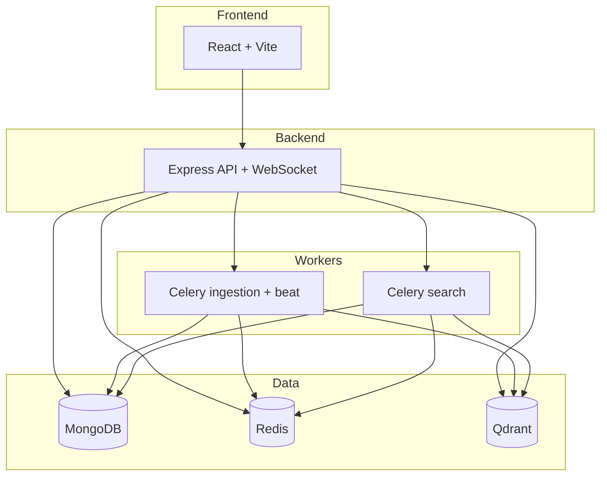

# Sistema RAG

Plataforma self-hosted para ingesta, indexado y búsqueda semántica de documentos y correos. El stack combina un frontend React, una API Node/Express, workers Python/Celery y servicios de soporte con MongoDB, Redis y Qdrant.

## Qué incluye

- Búsqueda semántica híbrida con embeddings densos, sparse retrieval y reranking.
- Ingesta de PDF, PST y correo IMAP.
- Gestión de usuarios, grupos, carpetas y permisos.
- Panel de administración, logs y configuración operativa.
- Despliegue local con `docker compose` y despliegue multi-nodo con Swarm.

## Arquitectura



## Quick Start Local

Requisitos mínimos:

- Docker Engine
- Docker Compose v2

Pasos:

```bash
cp .env.example .env
docker compose -f docker-compose.yml.local up --build -d
docker compose -f docker-compose.yml.local logs -f
```

Acceso por defecto:

- App: `http://localhost`
- API health: `http://localhost:8000/api/v1/health`
- Qdrant: `http://localhost:6333/dashboard`

Parada:

```bash
docker compose -f docker-compose.yml.local down
```

Detalle completo: [docs/quickstart-local.md](docs/quickstart-local.md)

## Quick Start Swarm

Pensado para varios nodos con carpeta compartida para uploads.

1. Monta la misma exportación NFS en todos los nodos.
2. Copia `.env.example` a `.env` y ajusta `UPLOADS_HOST_PATH`.
3. Construye las imágenes en los nodos donde vayan a correr o usa `deploy.sh`.
4. Despliega con `docker stack deploy -c docker-compose.yml rag`.

Guía completa: [docs/swarm-proxmox-nfs.md](docs/swarm-proxmox-nfs.md)

## Documentación

- [Índice de documentación](docs/README.md)
- [Quick Start Local](docs/quickstart-local.md)
- [Quick Start Swarm](docs/swarm-proxmox-nfs.md)
- [Checklist para repo público](docs/public-repo-checklist.md)
